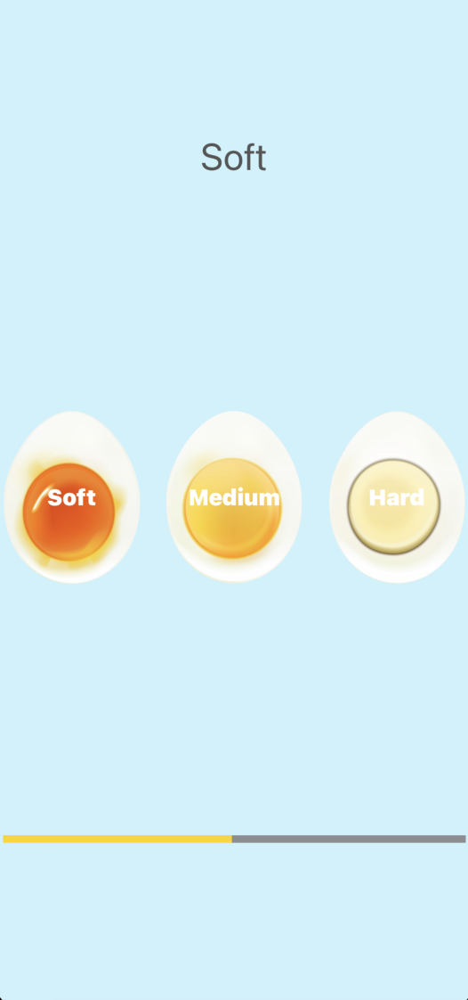
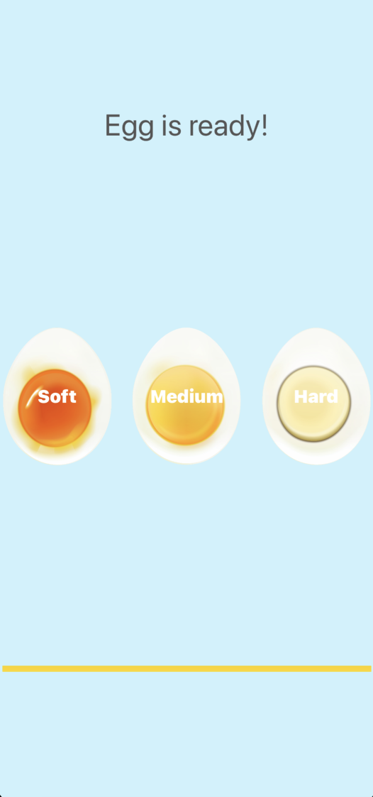

# Egg Timer

### A simple iOS/iPadOS timer with three operating modes, 5, 7 and 12 minutes

## Used technologies and tools

- Swift
- UIKit

*This project was developed as part of The Complete iOS App Development Bootcamp by London App Brewery*

*Minimum supported OS version is 13.0*

## Illustrations

### Timer working:

### Timer finished:

